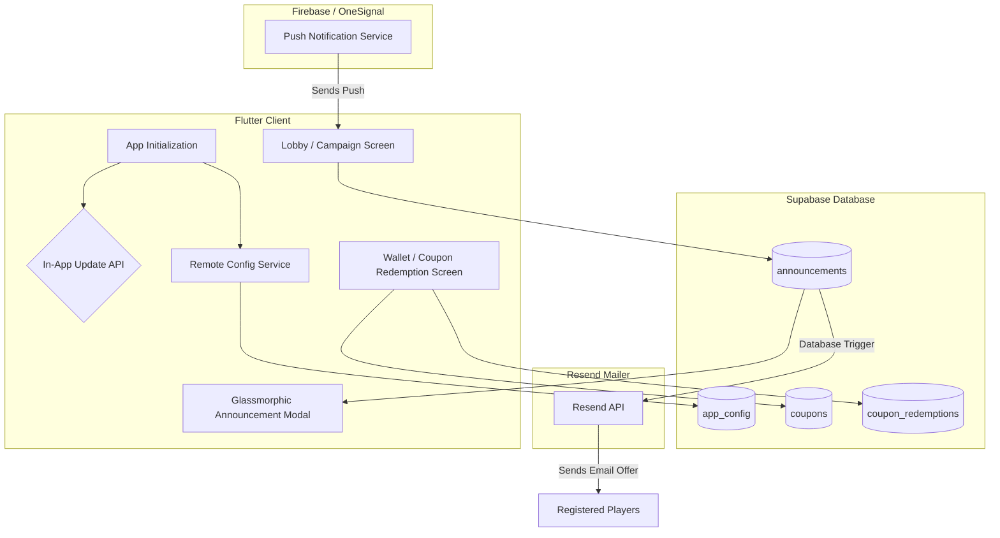

# Implementation Plan — Live Updates, Notifications & Coupon Campaigns

This plan outlines the architecture for introducing automated update prompts, lock-screen notifications, remote content config, in-game offer banners, and email coupon codes for *Aqua Sort*.

---

## 🏗️ Architecture Design



---

## 🛠️ Proposed Changes

### 1. In-App Updates & Remote Config
* Add `in_app_update: ^4.2.2` to `pubspec.yaml`.
* Implement a central `UpdateService` checking the native Google Play API. If an update is available:
  * **Flexible update:** Downloads in the background, showing a snackbar when ready to install.
  * **Immediate update:** Blocks play with a progress overlay until the app is updated.
* Create a `RemoteConfigService` reading key-value flags from a new Supabase table `app_config` (e.g., `min_version`, `maintenance_mode`, `double_coins_weekend`).

### 2. Supabase-Powered In-App Announcements & Coupons
* Create three tables in the Supabase database:
  * `announcements`: Stores title, content, image URL, action button links, and validity dates for flash banner popups.
  * `coupons`: Stores coupon codes (e.g., `WELCOME100`), coin rewards, max redemption limits, and expiration dates.
  * `coupon_redemptions`: Logs which users have claimed which coupons to prevent double claiming.
* Add an announcement modal widget `announcement_modal.dart` featuring a premium frosted-glass layout that overlay-renders active promotions on the lobby screen.
* Add a `Redeem Coupon` field in the user's profile settings or coin shop allowing players to type code strings and instantly update their wallet balance.

### 3. Push Notifications (OneSignal)
* Add `onesignal_flutter: ^5.2.0` to `pubspec.yaml`.
* Configure OneSignal initialization in `main.dart`.
* Map the active Supabase user ID to OneSignal (`OneSignal.User.setExternalId`) so push alerts can be targeted directly to specific player segments (e.g., active players, new sign-ups, or custom offers).

### 4. Registered Email Campaigns (Resend)
* Create a Supabase Database Webhook that fires whenever a new record is added to the `announcements` table with `send_email: true`.
* The webhook triggers an Edge Function that reads all active player email addresses and sends a styled HTML coupon email template via **Resend** (using your existing Resend integration).

---

## 🗄️ Database Schemas (SQL)

```sql
-- Config parameters
CREATE TABLE public.app_config (
    key TEXT PRIMARY KEY,
    value JSONB NOT NULL,
    updated_at TIMESTAMPTZ DEFAULT NOW()
);

-- Active promos and banners
CREATE TABLE public.announcements (
    id UUID PRIMARY KEY DEFAULT gen_random_uuid(),
    title TEXT NOT NULL,
    content TEXT NOT NULL,
    image_url TEXT,
    action_label TEXT,
    action_path TEXT,
    start_date TIMESTAMPTZ NOT NULL,
    end_date TIMESTAMPTZ NOT NULL,
    is_active BOOLEAN DEFAULT TRUE,
    send_email BOOLEAN DEFAULT FALSE,
    created_at TIMESTAMPTZ DEFAULT NOW()
);

-- Coupon rewards
CREATE TABLE public.coupons (
    code TEXT PRIMARY KEY,
    coin_reward INTEGER NOT NULL DEFAULT 0,
    max_uses_per_user INTEGER NOT NULL DEFAULT 1,
    expiration TIMESTAMPTZ,
    is_active BOOLEAN DEFAULT TRUE
);

-- Redemption logs
CREATE TABLE public.coupon_redemptions (
    id UUID PRIMARY KEY DEFAULT gen_random_uuid(),
    user_id UUID REFERENCES auth.users(id) ON DELETE CASCADE,
    coupon_code TEXT REFERENCES public.coupons(code) ON DELETE CASCADE,
    redeemed_at TIMESTAMPTZ DEFAULT NOW(),
    UNIQUE(user_id, coupon_code)
);
```

---

## 🧪 Verification Plan

### Automated Tests
* `flutter analyze` to ensure zero compilation or syntax errors.
* Integration test script simulating:
  * Coupon validation (expired, invalid, and already claimed states).
  * Valid coupon redemption awarding correct coin counts to database wallet.

### Manual Verification
* Insert a test record in `announcements` and verify the glassmorphic modal displays automatically on lobby launch.
* Verify the coupon field correctly processes and rejects custom code entries.
* Push a test notification from the OneSignal dashboard and verify it rings the emulator lock screen.
* Trigger a test coupon email and verify receipt of a styled email template.
