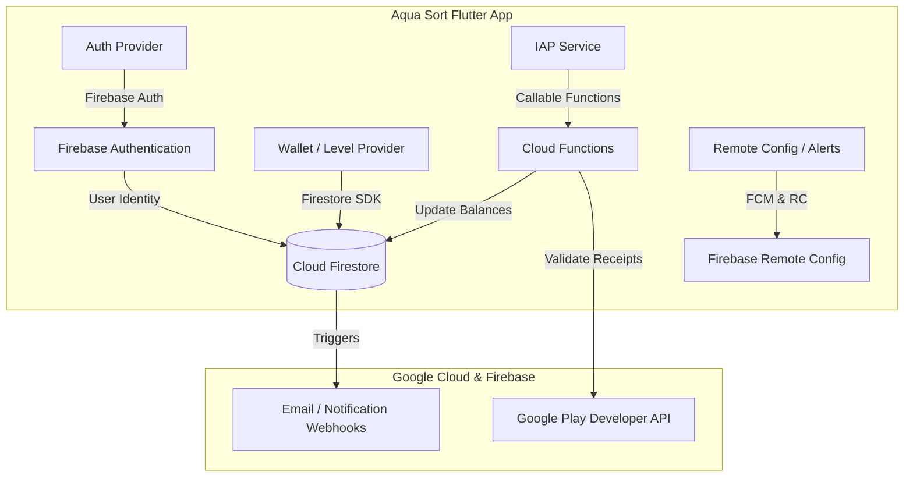

# Migration Plan: Moving Auth & Database to Google Ecosystem (Firebase / GCP)

This plan outlines the architecture, strategy, and execution steps to migrate **Aqua Sort** from Supabase to Google's infrastructure (**Firebase Authentication + Cloud Firestore / Cloud Functions** or **Google Cloud SQL PostgreSQL**).

---

## User Review Required

> [!IMPORTANT]
> **Choosing the Target Google Stack**:
> There are two primary paths on Google Cloud:
> 1. **Firebase Suite (Strongly Recommended for Flutter Games)**:
>    - **Auth**: Firebase Authentication (Native Google Sign-In, Phone OTP, Email/Password, Anonymous guest).
>    - **Database**: Cloud Firestore (Real-time syncing, offline cache, scalable document database).
>    - **Backend**: Firebase Cloud Functions (TypeScript/Node.js) for IAP receipt validation and notifications.
>    - **Push & Config**: Firebase Cloud Messaging (FCM) + Firebase Remote Config.
> 2. **Google Cloud SQL (PostgreSQL on GCP)**:
>    - Keeps the existing relational SQL tables and PL/pgSQL procedures (`update_webspider_coins_v1`).
>    - Requires a REST API backend hosted on Google Cloud Run to interface with Flutter.
>
> *Unless you have a specific requirement for SQL, **Option 1 (Firebase)** is the standard, best-practice stack for Flutter on Google.*

> [!WARNING]
> **Data & User Account Migration**:
> - Existing user passwords stored in Supabase use bcrypt/scrypt hashes and cannot be read in plaintext. 
> - Users can either be exported and imported into Firebase Auth with password hash configuration (Firebase CLI `auth:import`), or prompted to reset passwords / use OTP on their first login.

---

## Migration Architecture Overview

---

## Proposed Changes

### 1. Google Cloud / Firebase Setup & Configuration
- Create or link Firebase Project in Google Cloud Console (`aqua-sort-mobile` / `webspider-studios`).
- Add Android app (`com.webspider.aquasort.mobile`) and generate `google-services.json`.
- Enable Firebase Auth Providers (Email/Password, Google, Phone/SMS, Anonymous).
- Enable Cloud Firestore in Production Mode with Security Rules.

---

### 2. Database Schema Migration (PostgreSQL -> Firestore)

| Supabase Table | Firestore Collection | Document Structure |
| :--- | :--- | :--- |
| `profiles` | `users/{userId}` | `username`, `displayName`, `email`, `phone`, `coins`, `webspiderCoins`, `ownedSkins`, `isPremium`, `dailyStreakCount`, `lastDailyClaimAt`, `claimedMilestones` |
| `transactions` | `users/{userId}/transactions/{txId}` | `type` (credit/debit), `amount`, `reason`, `metadata`, `createdAt` |
| `purchases` | `purchases/{purchaseId}` | `userId`, `productId`, `purchaseToken`, `platform`, `status`, `createdAt` |
| `coupons` | `coupons/{couponCode}` | `coinsReward`, `maxUses`, `usedCount`, `isActive`, `expiresAt` |
| `coupon_redemptions` | `coupons/{couponCode}/redemptions/{userId}` | `userId`, `redeemedAt` |
| `announcements` | `announcements/{announcementId}` | `title`, `content`, `bannerUrl`, `actionUrl`, `isActive`, `createdAt` |

---

### 3. Flutter Dependencies & Configuration

#### [MODIFY] [`pubspec.yaml`](file:///D:/.gemini/antigravity/scratch/aqua-sort-flutter/pubspec.yaml)
- Remove `supabase_flutter` dependency.
- Add Google Firebase dependencies:
  - `firebase_core: ^3.12.0`
  - `firebase_auth: ^5.5.0`
  - `cloud_firestore: ^5.6.0`
  - `firebase_remote_config: ^5.4.0`
  - `firebase_messaging: ^15.2.0`
  - `google_sign_in: ^6.2.2`

#### [MODIFY] [`android/build.gradle.kts`](file:///D:/.gemini/antigravity/scratch/aqua-sort-flutter/android/build.gradle.kts) & [`android/app/build.gradle.kts`](file:///D:/.gemini/antigravity/scratch/aqua-sort-flutter/android/app/build.gradle.kts)
- Add `com.google.gms.google-services` plugin.
- Place `google-services.json` in `android/app/`.

---

### 4. Client Code Refactoring

#### [MODIFY] [`lib/main.dart`](file:///D:/.gemini/antigravity/scratch/aqua-sort-flutter/lib/main.dart)
- Initialize `Firebase.initializeApp()` instead of `Supabase.initialize()`.

#### [MODIFY] [`lib/features/auth/providers/auth_provider.dart`](file:///D:/.gemini/antigravity/scratch/aqua-sort-flutter/lib/features/auth/providers/auth_provider.dart)
- Replace Supabase Auth with `FirebaseAuth.instance`.
- Replace PostgREST user profile fetches with Firestore `users` collection snapshots/documents.
- Support Phone OTP, Email/Password, Google Sign-In, and custom Username resolution via Firestore index.

#### [MODIFY] [`lib/core/services/wallet_service.dart`](file:///D:/.gemini/antigravity/scratch/aqua-sort-flutter/lib/core/services/wallet_service.dart)
- Replace Supabase RPC calls with atomic Firestore batch writes / `runTransaction` updates.
- Atomic coin deduction, awarding, and transaction logging.

#### [MODIFY] [`lib/core/services/iap_service.dart`](file:///D:/.gemini/antigravity/scratch/aqua-sort-flutter/lib/core/services/iap_service.dart)
- Call Google Cloud Function / Firebase Callable Function `verifyGooglePlayPurchase` instead of Supabase Edge Function.

#### [MODIFY] [`lib/features/profile/providers/premium_provider.dart`](file:///D:/.gemini/antigravity/scratch/aqua-sort-flutter/lib/features/profile/providers/premium_provider.dart)
- Sync `isPremium` status with Firestore user document.

#### [MODIFY] [`lib/features/lobby/providers/coupon_provider.dart`](file:///D:/.gemini/antigravity/scratch/aqua-sort-flutter/lib/features/lobby/providers/coupon_provider.dart)
- Validate and redeem coupons using Firestore transactions.

---

### 5. Backend Serverless Functions (Google Cloud Functions)
- **`verifyGooglePlayPurchase`**: Verify Google Play purchase tokens via official Google APIs and credit user documents in Firestore.
- **`onAnnouncementCreated`**: Trigger marketing emails or push notifications when an announcement is published.

---

## Verification Plan

### Automated Tests & Code Validation
- Run `flutter analyze` to ensure complete removal of Supabase references and zero compilation errors with Firebase SDKs.
- Test Firestore security rules with Firebase Emulator Suite.

### Manual Verification
1. **Authentication Flow**: Test Email registration, Password login, Google Sign-In, and Guest mode.
2. **Database Sync**: Test level completions, coin awards, skin purchases, daily streak claims, and check real-time updates in the Firebase Console.
3. **In-App Purchases**: Perform test purchases and verify Firestore balance updates via Cloud Functions.
4. **App Build**: Compile release `.aab` (Build 10) and verify execution on device via ADB.
