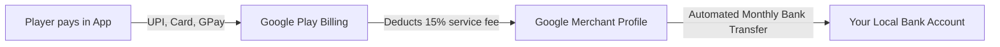
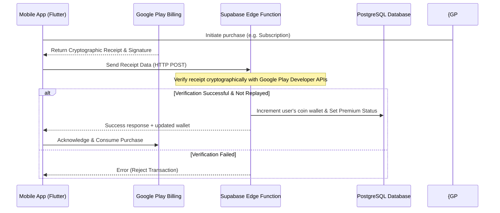

# Implementation Plan — In-App Purchases (IAPs) & Premium Payments

Integrate the official Flutter `in_app_purchase` package to replace the existing mock checkout dialogs. This will allow players to buy subscriptions, passes, and consumable coin packs using Google Play Billing.

---

## 🏦 Where Does the Money Go? (Payout Flow)

Here is exactly how you get paid when a user purchases coins or a subscription in your game:



1. **Transaction**: The player pays Google in their local currency (INR, USD, EUR, etc.).
2. **Collection**: Google collects the funds and holds them in your **Google Merchant Profile** (which you set up in Settings > Merchant Account).
3. **Google's Cut**: Google charges a **15% service fee** for the first $1M USD you make per year. Google automatically deducts this cut at the time of purchase.
4. **Direct Payout**: On the **15th of every month**, Google automatically wires your accumulated earnings (the remaining 85%) directly to the **Bank Account** you linked in your Merchant Profile. (Indian banks receive payouts in INR).

---

## ⚙️ Auto-Renewal & Cancellation Management

Google Play regulations mandate that all auto-renewals, billing terms, and subscription cancellations be managed directly through the user's Google Play Store account.

To make this seamless and transparent for players:
1. **"Manage Subscription" Deep-link**: We will add a prominent **"Manage Subscription"** button inside the profile screen and premium purchase panels.
2. **Direct Action**: Tapping this button uses the `url_launcher` package to open the Google Play Store subscription management screen directly on the user's device:
   `https://play.google.com/store/account/subscriptions?package=YOUR_PACKAGE_NAME`
3. **Grace Period**: If a user cancels their auto-renewal before the billing date, Google Play automatically stops future charges. The database keeps their Premium status active until the end of the paid billing cycle, ensuring a fair, complaint-free experience.

---

## ⚡ Fast, Non-Blocking, & Slow-Internet Resilient Checkout UX

To prevent the app from freezing, lagging, or getting stuck during purchases—especially on **slow internet connections (2G/3G/Rural mobile networks)**:

1. **Decoupled Local/Remote Flow**: Google Play's checkout panel runs at the Android OS system level, meaning it performs its own secure payment transaction.
2. **Optimistic Local Activation (Instant Gratification)**:
   * The moment Google Play reports a successful transaction locally on the device, the app **instantly unlocks the premium features or credits the coins locally** and closes the checkout modal.
   * The player does **not** have to wait for a slow network request to finish before enjoying their purchase.
3. **Background Database Sync**:
   * While the user is already playing, the app sends the receipt token to the Supabase Edge Function in the background to permanently log the transaction and sync the cloud wallet.
4. **Resilient Offline Retry Queue**:
   * If the network is extremely slow or drops entirely during this background sync, the app caches the transaction receipt locally in secure storage and retries the sync automatically as soon as a stable connection is detected, ensuring zero lost purchases and preventing refunds.

---

## 🎨 Premium Payment Status HUD (Clear User Communication)

To avoid user confusion, we will show a beautiful, glassmorphic loading/status overlay (`IapStatusHud`) that clearly shows the checkout state with premium styling and human-friendly messages:

```
[ Pulsing Icon ]
   "Contacting Store..."       --> Communicating with Google Play.
   "Waiting for Payment..."    --> Google Play Billing sheet is open.
   "Securing Purchase..."      --> Validating transaction receipt.
   "Syncing in Background..."  --> Slow network: Purchase is safe, continuing play.
   "Success! 🎉"               --> Benefits/coins successfully unlocked.
```

### Human-Friendly Error Messaging:
Instead of raw system or API exception logs, the app will display clear, actionable cards:
* **User Cancelled**: *"Transaction cancelled. No charges were made."*
* **Network Timeout**: *"Payment completed! Syncing your coins in the background. You can start playing immediately."*
* **General Failure**: *"Transaction could not be completed. Please try again or check your Play Store payment method."*

---

## 🧪 Premium Plan Offerings (Multi-Duration Suite)

| Plan Duration | Product ID | Type | US/EU Price | India Price | Included Coin Bundle (Instant) | Daily Login Allowance |
| :--- | :--- | :--- | :--- | :--- | :--- | :--- |
| **Daily (24h Pass)** | `webspider_premium_pass_daily` | Consumable | $0.19 | ₹9 | 100 Regular, 2 Gold | N/A (1-day duration) |
| **Weekly Sub** | `webspider_premium_sub_weekly` | Subscription | $0.49/wk | ₹19/wk | 300 Regular, 5 Gold | +2 Gold / day |
| **Monthly Sub** | `webspider_premium_sub_monthly` | Subscription | $1.49/mo | ₹49/mo | 1,000 Regular, 20 Gold | +5 Gold / day |
| **Quarterly Sub (3m)** | `webspider_premium_sub_quarterly` | Subscription | $3.49/3m | ₹129/3m | 3,500 Regular, 70 Gold | +8 Gold / day |
| **Half-Yearly Sub (6m)** | `webspider_premium_sub_half_yearly` | Subscription | $5.99/6m | ₹229/6m | 7,500 Regular, 150 Gold | +10 Gold / day |
| **Yearly Sub (1yr)** | `webspider_premium_sub_yearly` | Subscription | $9.99/yr | ₹399/yr | 15,000 Regular, 350 Gold | +12 Gold / day |

---

## Designed Economical Coin Packs (Consumable)

| Product Name | Product ID | US/EU Price | India Price | Description |
| :--- | :--- | :--- | :--- | :--- |
| **Bronze Coin Pack** | `webspider_coins_pack_regular` | $0.49 | ₹29 | 300 Regular Coins (For standard cosmetics/skins). |
| **Silver Coin Pack** | `webspider_coins_pack_silver` | $0.99 | ₹49 | 30 Silver Coins (For premium cosmetics). |
| **Gold Coin Pack** | `webspider_coins_pack_gold` | $1.99 | ₹99 | 15 Gold Coins (For revives and premium undos). |
| **Obsidian Vault Pack** | `webspider_coins_pack_obsidian` | $2.99 | ₹149 | 5 Obsidian Coins (Legendary level items). |

---

## 🔒 Security & Anti-Hack Architecture

To prevent players from hacking their coin balances locally, we will implement **Server-Side Receipt Verification**:



---

## Proposed Changes

### Core Dependencies

#### [MODIFY] [pubspec.yaml](file:///f:/.gemini/antigravity/scratch/aqua-sort-flutter/pubspec.yaml)
* Add `in_app_purchase: ^3.2.0` (or compatible version).

---

### Billing & Purchase Service Layer

#### [NEW] [iap_service.dart](file:///f:/.gemini/antigravity/scratch/aqua-sort-flutter/lib/core/services/iap_service.dart)
* Create `IapService` as a singleton to:
  * Initialize the Google Play billing connection.
  * Listen to the `purchaseStream` globally to process transactions.
  * Send receipt tokens to Supabase Edge Function for cryptographic validation.
  * Provide functions to purchase specific products: `buySubscription(String planId)`, `buyDailyPass()`, and `buyCoins(String productId)`.
  * Support `restorePurchases()` for active subscriptions.

#### [MODIFY] [main.dart](file:///f:/.gemini/antigravity/scratch/aqua-sort-flutter/lib/main.dart)
* Initialize `IapService.instance.initialize()` at startup.

---

### UI & Presentation Layer

#### [MODIFY] [premium_purchase_dialog.dart](file:///f:/.gemini/antigravity/scratch/aqua-sort-flutter/lib/features/profile/widgets/premium_purchase_dialog.dart)
* Show list of all available plans (Daily, Weekly, Monthly, Quarterly, Half-Yearly, Yearly) with their pricing and coin allowances.
* Hook buttons to correct `IapService` methods.
* Add a "Restore Purchases" button.

#### [MODIFY] [spider_coin_store_dialog.dart](file:///f:/.gemini/antigravity/scratch/aqua-sort-flutter/lib/features/lobby/widgets/spider_coin_store_dialog.dart)
* Add new purchase options listing the real coin packs and prices.
* Bind the pack purchase buttons to `IapService.instance.buyCoins(productId)`.

---

## Verification Plan

### Automated Tests
* Run `flutter analyze` to ensure there are no compilation errors.

### Manual Verification
* Deploy a test version of the app to a Google Play Console **Internal Testing** track.
* Register your Gmail address under **License Testing** in the Developer Console to test purchases using a dummy test credit card (without charging real money).
