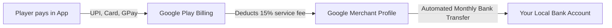
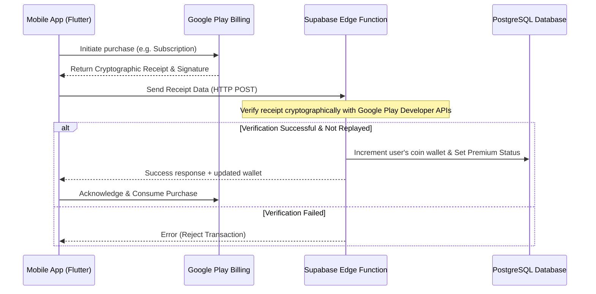

# Implementation Plan — In-App Purchases (IAPs) & Premium Payments

Integrate the official Flutter `in_app_purchase` package to replace the existing mock checkout dialogs. This will allow players to buy subscriptions and consumable coin packs using Google Play Billing.

---

## 🏦 Where Does the Money Go? (Payout Flow)

Here is exactly how you get paid when a user purchases coins or a subscription in your game:

1. **Transaction**: The player pays Google in their local currency (INR, USD, EUR, etc.).
2. **Collection**: Google collects the funds and holds them in your **Google Merchant Profile** (which you set up in Settings > Merchant Account).
3. **Google's Cut**: Google charges a **15% service fee** for the first $1M USD you make per year. Google automatically deducts this cut at the time of purchase.
4. **Direct Payout**: On the **15th of every month**, Google automatically wires your accumulated earnings (the remaining 85%) directly to the **Bank Account** you linked in your Merchant Profile. (Indian banks receive payouts in INR).

---

## 🧪 Updated Alchemist Premium Pass (Monthly Subscription)

To create a recurring revenue stream, the Premium feature will be a **Monthly Auto-Renewable Subscription** that bundles coin allowances:

* **Product ID**: `webspider_premium_subscription_monthly`
* **US/EU Price**: $1.49 / month
* **India Price**: ₹49 / month (highly affordable and optimized for volume)

### Subscription Benefits:
* **Ad-Free**: Zero Banner or Interstitial ads.
* **QoL Boost**: Unlimited Undo & Pauses.
* **Instant Coin Bundle (Granted immediately upon purchase/renewal)**:
  * 1,000 Regular Coins (Bronze)
  * 50 Silver Coins
  * 20 Gold Coins
* **Daily Allowance**: +5 Gold Coins granted automatically every day they log in while their subscription is active.

---

## Designed Economical Pricing Plan (Localized)

| Product Name | Product ID | US/EU Price | India Price | Description |
| :--- | :--- | :--- | :--- | :--- |
| **Premium Pass** (Subscription) | `webspider_premium_subscription_monthly` | $1.49/mo | ₹49/mo | Ad-Free, Unlimited Undo, Instant + Daily Coins. |
| **Bronze Coin Pack** (Consumable) | `webspider_coins_pack_regular` | $0.49 | ₹29 | 300 Regular Coins (For standard cosmetics/skins). |
| **Silver Coin Pack** (Consumable) | `webspider_coins_pack_silver` | $0.99 | ₹49 | 30 Silver Coins (For premium cosmetics). |
| **Gold Coin Pack** (Consumable) | `webspider_coins_pack_gold` | $1.99 | ₹99 | 15 Gold Coins (For revives and premium undos). |
| **Obsidian Vault Pack** (Consumable) | `webspider_coins_pack_obsidian` | $2.99 | ₹149 | 5 Obsidian Coins (Legendary level items). |

---

## 🔒 Security & Anti-Hack Architecture

To prevent players from hacking their coin balances locally, we will implement **Server-Side Receipt Verification**:

---

## Proposed Changes

### Core Dependencies

#### [MODIFY] [pubspec.yaml](file:///f:/.gemini/antigravity/scratch/aqua-sort-flutter/pubspec.yaml)
* Add `in_app_purchase: ^3.2.0` (or compatible version).

---

### Billing & Purchase Service Layer

#### [NEW] [iap_service.dart](file:///f:/.gemini/antigravity/scratch/aqua-sort-flutter/lib/core/services/iap_service.dart)
* Create `IapService` as a singleton to:
  * Initialize the Google Play billing connection.
  * Listen to the `purchaseStream` globally to process transactions.
  * Send receipt tokens to Supabase Edge Function for cryptographic validation.
  * Provide functions to purchase specific products: `buySubscription()` and `buyCoins(String productId)`.
  * Support `restorePurchases()` for the active subscription.

#### [MODIFY] [main.dart](file:///f:/.gemini/antigravity/scratch/aqua-sort-flutter/lib/main.dart)
* Initialize `IapService.instance.initialize()` at startup.

---

### UI & Presentation Layer

#### [MODIFY] [premium_purchase_dialog.dart](file:///f:/.gemini/antigravity/scratch/aqua-sort-flutter/lib/features/profile/widgets/premium_purchase_dialog.dart)
* Replace the mock callback with `IapService.instance.buySubscription()`.
* Show a loading spinner during the purchase flow.
* Add a "Restore Purchases" button.
* Display the coin bundle benefits (1,000 Bronze, 50 Silver, 20 Gold coins).

#### [MODIFY] [spider_coin_store_dialog.dart](file:///f:/.gemini/antigravity/scratch/aqua-sort-flutter/lib/features/lobby/widgets/spider_coin_store_dialog.dart)
* Add new purchase options listing the real coin packs and prices.
* Bind the pack purchase buttons to `IapService.instance.buyCoins(productId)`.

---

## Verification Plan

### Automated Tests
* Run `flutter analyze` to ensure there are no compilation errors.

### Manual Verification
* Deploy a test version of the app to a Google Play Console **Internal Testing** track.
* Register your Gmail address under **License Testing** in the Developer Console to test purchases using a dummy test credit card (without charging real money).
