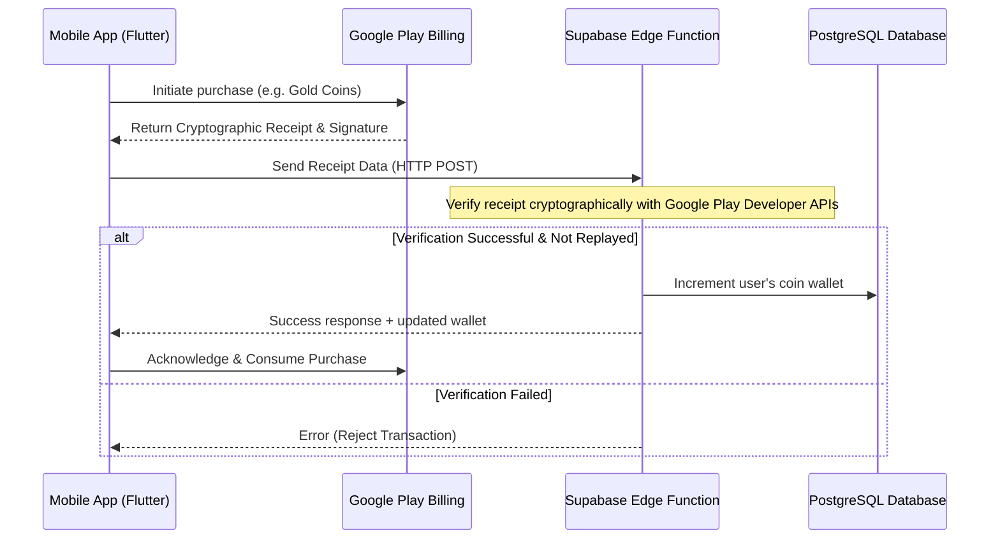

# Implementation Plan — In-App Purchases (IAPs) & Premium Payments

Integrate the official Flutter `in_app_purchase` package to replace the existing mock checkout dialogs. This will allow players to buy real premium upgrades (non-consumable) and coin packs (consumable) using Google Play Billing.

---

## Closed Testing & Release Strategy

### Do we need to re-run the 14-day closed testing?
**No.** 
The 14-day / 20-tester closed testing requirement is a **one-time milestone** required by Google Play to approve new developer accounts for publishing. 
* Since you have already completed this, your account is fully qualified.
* You can publish updates, new features, and IAPs directly to the **Production track** without waiting or testing for 14 days.
* For safe development testing, we will use Play Console's **Internal Testing** track, which allows instant updates and downloads for testers.

---

## Designed Economical Pricing Plan (Localized)

Google Play automatically displays prices in the user's local currency (INR in India, USD in the US, EUR in Europe) and enables localized local payment methods (e.g., UPI, NetBanking, Google Pay) automatically based on their billing address.

### Proposed Product Offerings & Price Points:

| Product Name | Product ID | US/EU Price | India Price | Description |
| :--- | :--- | :--- | :--- | :--- |
| **Go Premium Upgrade** | `webspider_premium_upgrade` | $1.99 | ₹99 | Permanent Ad-Free, Unlimited Undo & Pauses. |
| **Bronze Coin Pack** | `webspider_coins_pack_regular` | $0.49 | ₹29 | 300 Regular Coins (For standard cosmetics/skins). |
| **Silver Coin Pack** | `webspider_coins_pack_silver` | $0.99 | ₹49 | 30 Silver Coins (For premium cosmetics). |
| **Gold Coin Pack** | `webspider_coins_pack_gold` | $1.99 | ₹99 | 15 Gold Coins (For revives and premium undos). |
| **Obsidian Vault Pack** | `webspider_coins_pack_obsidian` | $2.99 | ₹149 | 5 Obsidian Coins (Legendary level items). |

---

## 🔒 Security & Anti-Hack Architecture

To ensure the game cannot be modded, patched (e.g., with Lucky Patcher), or hacked, we will implement **Server-Side Receipt Verification**:

1. **No Third-Party Fees**: We use the native Google Play Billing API directly. There are no monthly payments or fees for payment gateways.
2. **Server Verification**: The mobile app never directly increments coins. When a purchase succeeds, the app sends the purchase token to a secure Supabase Edge Function.
3. **Google API Call**: The Edge Function verifies the transaction token directly with Google Play's server APIs.
4. **Database Credit**: Only after Google confirms the purchase is genuine does the database securely update the player's balance.

---

## Proposed Changes

### Core Dependencies

#### [MODIFY] [pubspec.yaml](file:///f:/.gemini/antigravity/scratch/aqua-sort-flutter/pubspec.yaml)
* Add `in_app_purchase: ^3.2.0` (or compatible version).

---

### Billing & Purchase Service Layer

#### [NEW] [iap_service.dart](file:///f:/.gemini/antigravity/scratch/aqua-sort-flutter/lib/core/services/iap_service.dart)
* Create `IapService` as a singleton to:
  * Initialize the Google Play / App Store billing connection.
  * Listen to the `purchaseStream` globally to process transactions.
  * Verify transactions (locally or via Supabase edge functions).
  * Auto-complete transactions.
  * Provide functions to purchase specific products: `buyPremium()` and `buyCoins(String productId)`.
  * Support `restorePurchases()` for the premium upgrade.

#### [MODIFY] [main.dart](file:///f:/.gemini/antigravity/scratch/aqua-sort-flutter/lib/main.dart)
* Initialize `IapService.instance.initialize()` at startup.

---

### UI & Presentation Layer

#### [MODIFY] [premium_purchase_dialog.dart](file:///f:/.gemini/antigravity/scratch/aqua-sort-flutter/lib/features/profile/widgets/premium_purchase_dialog.dart)
* Replace the mock callback with `IapService.instance.buyPremium()`.
* Show a loading spinner during the purchase flow.
* Add a "Restore Purchases" button.

#### [MODIFY] [spider_coin_store_dialog.dart](file:///f:/.gemini/antigravity/scratch/aqua-sort-flutter/lib/features/lobby/widgets/spider_coin_store_dialog.dart)
* Add new purchase options listing the real coin packs and prices.
* Bind the pack purchase buttons to `IapService.instance.buyCoins(productId)`.

---

## Verification Plan

### Automated Tests
* Run `flutter analyze` to ensure there are no compilation errors.

### Manual Verification
* Deploy a test version of the app to a Google Play Console **Internal Testing** track.
* Register your Gmail address under **License Testing** in the Developer Console to test purchases using a dummy test credit card (without charging real money).
