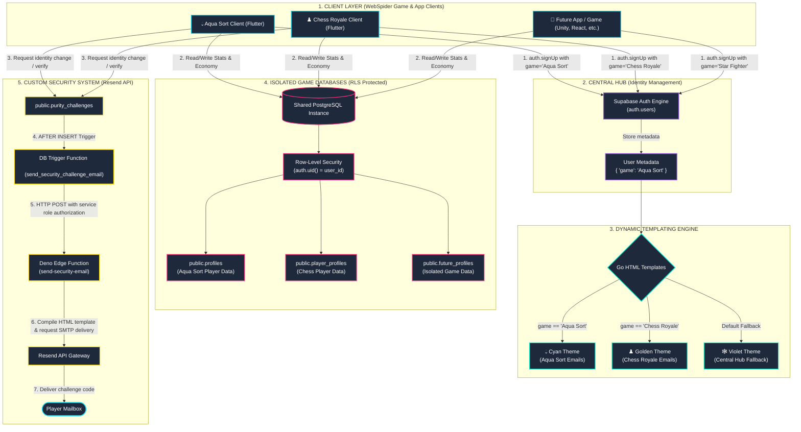

# WebSpider Studios - Universal Auth Integration & Reference Guide

This document serves as the permanent, master reference tutorial for the **Universal Authentication System** used by **WebSpider Studios**. It describes the system architecture, directory layouts, database isolation, GitHub repositories, Supabase credentials, and the step-by-step workflow to integrate future games and applications.

---

## 📊 Visual System Architecture

The following diagram illustrates how the shared identity registry integrates with dynamic template rendering, isolated client databases, and custom security webhook emails:



---

## ⚙️ How It Works (Core Mechanics)

The universal auth system is designed to be **highly scalable**, **highly secure**, and **extremely modular**. It handles authentication centrally while isolating application databases and customizing branding on the fly.

### 1. Centralized Identity Engine
All players register to a single user directory in the shared database schema (`auth.users`). Once a player creates an account in one game, their identity is registered globally.
- **Benefits**: Seamless cross-game achievements, central accounts, single-sign-on (SSO), and lower database operational cost.
- **Identity Privacy**: Player identities separate the public **Display Name** (personal nickname, does not need to be unique) from a private unique **Username** (sensitive login ID, unique and secure) to prevent credentials harvesting. Logins can resolve by email, phone, or username, but public nicknames are disallowed for login routing.

### 2. Strict Player Data Isolation (Row-Level Security)
To ensure each game's data remains "separate and unbothered" from others:
- Each game has its own separate database table (e.g. `public.profiles` for Aqua Sort, `public.player_profiles` for Chess Royale).
- These tables have a primary key or column referencing `auth.users(id)` (foreign key relationship).
- **Row-Level Security (RLS)** is enabled on all tables, ensuring that a player can only access or modify their own rows:
  ```sql
  CREATE POLICY "User owns data" ON public.my_table
      FOR ALL USING (auth.uid() = user_id);
  ```
- No game can ever access another game's table because queries are bounded to specific table objects.

### 3. Dynamic Go Email Branding
We customize the authentication experience dynamically using **Go templates** directly inside Supabase's email templates.
- **Metadata Binding**: During sign up, the client sends a `game` metadata field:
  ```dart
  await supabase.auth.signUp(
    email: email,
    password: password,
    data: {'game': 'Aqua Sort'},
  );
  ```
- **Conditional Rendering**: Whenever Supabase triggers an email (OTP, Sign Up, Password Recovery, Email Swap), the Go templating system renders styled themes:
  ```html
  {{ if eq .Data.game "Aqua Sort" }}
    <!-- Aqua Sort styling & branding -->
    <div style="color: #00E5FF;">💧 Aqua Sort</div>
  {{ else if eq .Data.game "Chess Royale" }}
    <!-- Chess Royale styling & branding -->
    <div style="color: #FFD700;">♟️ Chess Royale</div>
  {{ else }}
    <!-- WebSpider Central Hub styling & branding -->
    <div style="color: #7000FF;">🕸️ WebSpider Hub</div>
  {{ end }}
  ```

### 4. Custom Verification Alerts (Purity Challenges)
For high-security operations (like changing email or resetting sensitive profile data), we deploy a table called `purity_challenges`. When the client inserts a challenge, a Postgres trigger invokes the `send-security-email` Edge Function, which dynamically delivers a customized Resend email branded with the specific game's context.

---

## 📂 Responsible Folders & Directories

The following is the map of responsible directories inside the workspace (`F:\.gemini\antigravity\scratch`):

- **<span style="color:#00E5FF">🟢 aqua-sort-flutter/</span>**: Codebase for the **Aqua Sort** game client.
  - [lib/features/auth/providers/auth_provider.dart](file:///f:/.gemini/antigravity/scratch/aqua-sort-flutter/lib/features/auth/providers/auth_provider.dart): Dynamic client authentication queries (`signUp`, `login`, `verifyOtp`, `forgotPassword`) and the custom security challenge integrations.
  - [supabase/functions/send-security-email/](file:///f:/.gemini/antigravity/scratch/aqua-sort-flutter/supabase/functions/send-security-email/): Deno edge function that integrates with the Resend API to send dynamic security verification codes.
  - [docs/supabase_hardening.sql](file:///f:/.gemini/antigravity/scratch/aqua-sort-flutter/docs/supabase_hardening.sql): Hardening SQL scripts containing RLS, table definitions, and triggers.

- **<span style="color:#FFD700">🟡 chess_app/</span>**: Codebase for the **Chess Royale** game client.
  - [lib/features/auth/providers/auth_provider.dart](file:///f:/.gemini/antigravity/scratch/chess_app/lib/features/auth/providers/auth_provider.dart): Auth logic corresponding to Chess Royale.
  - [supabase_migration.sql](file:///f:/.gemini/antigravity/scratch/chess_app/supabase_migration.sql): Database definitions for game-isolated player profiles and matches.

- **<span style="color:#9B5DE5">🟣 auth-system/</span>**: Repository for the universal auth web interface and login hub.

- **<span style="color:#00F5D4">🔵 email_viewer.html</span>**: Contains the HTML templates for all 12 Supabase email slots with pre-compiled subjects and body logic.

---

## 🔗 Git Repositories & Supabase Details

### GitHub Repositories
- **Aqua Sort Client**: [https://github.com/VR-WebSpider/aqua-sort-flutter.git](https://github.com/VR-WebSpider/aqua-sort-flutter.git)
- **WebSpider Portfolio / Landing Page**: [https://github.com/VR-WebSpider/vr-webspider.github.io.git](https://github.com/VR-WebSpider/vr-webspider.github.io.git)

### Supabase Hub Configuration
- **Project ID**: `zpwwjdiwcucwfuzyuiqu`
- **Dashboard URL**: [https://supabase.com/dashboard/project/zpwwjdiwcucwfuzyuiqu](https://supabase.com/dashboard/project/zpwwjdiwcucwfuzyuiqu)
- **API URL**: `https://zpwwjdiwcucwfuzyuiqu.supabase.co`
- **DB Host**: `db.zpwwjdiwcucwfuzyuiqu.supabase.co`

---

## 🚀 How to Integrate a New Game (Step-by-Step)

Follow these step-by-step instructions to connect a new game (e.g., *"Star Fighter"*) to the Universal Auth System:

### Step 1: Deploy Isolated Game Profile Table
Run this SQL script in the Supabase Dashboard SQL Editor. It creates the isolated data table and enforces that players can only access their own scores:

```sql
-- 1. Create the game table
CREATE TABLE public.star_fighter_profiles (
    id UUID PRIMARY KEY DEFAULT gen_random_uuid(),
    user_id UUID REFERENCES auth.users(id) ON DELETE CASCADE UNIQUE,
    player_name TEXT DEFAULT 'Pilot',
    high_score INTEGER DEFAULT 0,
    created_at TIMESTAMPTZ DEFAULT now()
);

-- 2. Enforce Row-Level Security
ALTER TABLE public.star_fighter_profiles ENABLE ROW LEVEL SECURITY;

-- 3. Create access policy
CREATE POLICY "Users can only manage their own stats." ON public.star_fighter_profiles
    FOR ALL USING (auth.uid() = user_id);
```

### Step 2: Bind the Game Identity during Signup
In the new game's login/signup flow, when invoking the Supabase SDK `signUp` function, pass the game name as a metadata parameter. This binds the dynamic brand permanently to that user:

```dart
// Dart Example (Flutter)
await supabase.auth.signUp(
  email: email,
  password: password,
  data: {
    'game': 'Star Fighter' // Binds the identity
  },
);
```

```javascript
// JavaScript Example (Web)
const { data, error } = await supabase.auth.signUp({
  email: 'pilot@example.com',
  password: 'secure-password',
  options: {
    data: {
      game: 'Star Fighter'
    }
  }
});
```

### Step 3: Add Styles to Global Email Templates
To brand email notifications for the new game, open the **[email_viewer.html](file:///f:/.gemini/antigravity/scratch/email_viewer.html)** file, find the style section, and add a style block for your game:

```html
{{ else if eq .Data.game "Star Fighter" }}
  /* Orange-Red styling for Space Arcade brand */
  .glow-bar { height: 4px; background: linear-gradient(90deg, #FF4500 0%, #FF8C00 100%); width: 100%; }
  .accent-color { color: #FF4500 !important; }
  .otp-box { background: rgba(255, 69, 0, 0.08); border: 1px solid rgba(255, 69, 0, 0.25); }
  .action-btn { background: linear-gradient(135deg, #FF4500 0%, #FF8C00 100%); color: #FFFFFF !important; }
{{ end }}
```
*Do the same inside the subject lines and the HTML body copy text selectors in the Supabase email dashboard.*

### Step 4: Hook into Purity Challenges
When initiating security challenges (such as an email swap or profile deletion verification) in the new game, insert rows into `public.purity_challenges` specifying your game tag:
```dart
await supabase.from('purity_challenges').insert({
  'user_id': userId,
  'code': code,
  'target_email': email,
  'challenge_type': 'PURITY_CHECK',
  'game': 'Star Fighter', // Dynamic name matching
  'expires_at': DateTime.now().add(Duration(minutes: 10)).toIso8601String(),
});
```
This triggers the function automatically to send the security code branded for your new game!
