# WebSpider Studios - Universal Currency Integration Guide

This guide explains how to connect other games made by WebSpider Studios (using **Unity**, **Unreal Engine**, **Godot**, or custom web stacks) to the live 7-Tier Universal Currency System.

---

## 📊 Visual Flow Graph

The diagram below shows how a client game (Unity/Unreal) securely authenticates a player and performs transactional coin updates on the cloud database.

```mermaid
sequenceDiagram
    autonumber
    actor Player as Player / Device
    participant Client as Client Game<br/>(Unity / Unreal / Godot)
    participant Auth as Supabase Auth<br/>(Sign-In / JWT)
    participant API as Supabase REST API<br/>(HTTPS Endpoint)
    participant RPC as Database RPC<br/>(update_webspider_currency_v1)
    participant DB as PostgreSQL DB<br/>(Profiles & Audit Logs)

    Player->>Client: Triggers Action (e.g. Spend 5 Gold Coins)
    Client->>Auth: Request Session Token (if not cached)
    Auth-->>Client: Return access_token (JWT) & user_id (UUID)
    
    rect rgb(20, 24, 40)
        Note right of Client: Secure Transaction Request
        Client->>API: HTTP POST /rpc/update_webspider_currency_v1<br/>Headers: apikey, Authorization (Bearer JWT)<br/>Payload: {user_id, currency_type, amount, reason, game_id}
        API->>RPC: Validate JWT & Call Function
    end

    rect rgb(30, 15, 45)
        Note over RPC,DB: Atomic Database Execution (PL/pgSQL)
        RPC->>DB: Lock User Profile Row (FOR UPDATE)
        DB-->>RPC: Current Balance
        alt New Balance < 0 (Insufficient Funds)
            RPC-->>API: Raise Exception (400 Bad Request)
            API-->>Client: Error: Insufficient Coins
            Client->>Player: Show "Not Enough Coins" Dialog
        else New Balance >= 0 (Success)
            RPC->>DB: Update Balance Column & updated_at
            RPC->>DB: Insert Audit Log into `transactions` table
            DB-->>RPC: Row Confirmed
            RPC-->>API: Return New Balance (Integer)
            API-->>Client: Return HTTP 200 OK with New Balance
            Client->>Player: Complete Action (Play sound / Unlock item)
        end
    end
```



---

## 🗺 Step-by-Step Setup Tutorial

Follow these steps to integrate the universal currency system into a new game project:

### Step 1: Obtain Project Credentials
To connect your game, you need the project's URL and the anonymous public API key.
- **Project URL**: `https://zpwwjdiwcucwfuzyuiqu.supabase.co`
- **Anon Key**: (Retrieve this from your Supabase dashboard settings under API keys).

### Step 2: Authenticate the Player (Get JWT)
To perform secure transactions on behalf of a user, they must login to the Supabase Authentication service. 
- You can sign in using **Email/Password**, **Phone OTP**, or **Anonymously (Guest)**.
- Once authenticated, cache the `user_id` (UUID string) and the `access_token` (JWT string).
- *Note: Send the `access_token` in the `Authorization: Bearer <token>` header of all transaction requests.*

### Step 3: Fetch Current Wallet Balances
Send a POST request to check the player's balances at game start.
- **Endpoint**: `https://zpwwjdiwcucwfuzyuiqu.supabase.co/rest/v1/rpc/get_webspider_currency_v1`
- **Body**: `{ "p_user_id": "USER_UUID" }`
- Use the returned JSON payload to populate your game HUD.

### Step 4: Perform a Balance Transaction
When a user spends currency (e.g. 5 Gold for an undo) or earns currency (e.g. 50 Copper for completing a level):
- **Endpoint**: `https://zpwwjdiwcucwfuzyuiqu.supabase.co/rest/v1/rpc/update_webspider_currency_v1`
- **Body**:
  ```json
  {
    "p_user_id": "USER_UUID",
    "p_currency_type": "gold",
    "p_amount": -5,
    "p_reason": "extra_undo",
    "p_game_id": "my_new_unity_game"
  }
  ```
- If the call returns a `200 OK` with the new balance, complete the gameplay action. If it returns `400 Bad Request`, show an "insufficient funds" warning or offer a store purchase.

---

## 🌐 HTTP REST API Specifications

### 1. Fetching Balances (`get_webspider_currency_v1`)
- **Method**: `POST`
- **Headers**:
  - `apikey`: `YOUR_SUPABASE_ANON_KEY`
  - `Authorization`: `Bearer USER_ACCESS_TOKEN`
  - `Content-Type`: `application/json`
- **Payload**:
  ```json
  {
    "p_user_id": "USER_UUID"
  }
  ```
- **Response Format (`200 OK`)**:
  ```json
  {
    "brass": 100,
    "copper": 200,
    "silver": 50,
    "gold": 10,
    "diamond": 0,
    "jade": 0,
    "obsidian": 0
  }
  ```

### 2. Updating Balances (`update_webspider_currency_v1`)
- **Method**: `POST`
- **Headers**: Same as above.
- **Payload**:
  ```json
  {
    "p_user_id": "USER_UUID",
    "p_currency_type": "gold",
    "p_amount": -5,
    "p_reason": "undo_purchase",
    "p_game_id": "lost_arrow_unity"
  }
  ```
- **Response Format (`200 OK`)**:
  Returns the new balance (integer) of that currency tier.
- **Error Response (`400 Bad Request`)**:
  ```json
  {
    "message": "Insufficient gold coins. Balance: 3, Required deduction: 5"
  }
  ```

---

## 🛠 Integration Code Snippets

### 1. Unity (C#)

```csharp
using System;
using System.Text;
using System.Collections;
using UnityEngine;
using UnityEngine.Networking;

public class WebSpiderWalletManager : MonoBehaviour
{
    private const string BaseUrl = "https://zpwwjdiwcucwfuzyuiqu.supabase.co/rest/v1/rpc";
    private const string AnonKey = "YOUR_SUPABASE_ANON_KEY";

    [Serializable]
    public class UpdateCurrencyPayload
    {
        public string p_user_id;
        public string p_currency_type;
        public int p_amount;
        public string p_reason;
        public string p_game_id;
    }

    public void SpendCoins(string userId, string userToken, string type, int amount, string reason, string gameId)
    {
        StartCoroutine(UpdateCurrencyRoutine(userId, userToken, type, amount, reason, gameId));
    }

    private IEnumerator UpdateCurrencyRoutine(string userId, string token, string type, int amount, string reason, string gameId)
    {
        string endpoint = $"{BaseUrl}/update_webspider_currency_v1";

        var payload = new UpdateCurrencyPayload
        {
            p_user_id = userId,
            p_currency_type = type,
            p_amount = amount,
            p_reason = reason,
            p_game_id = gameId
        };

        string jsonPayload = JsonUtility.ToJson(payload);
        
        using (UnityWebRequest request = new UnityWebRequest(endpoint, "POST"))
        {
            byte[] bodyRaw = Encoding.UTF8.GetBytes(jsonPayload);
            request.uploadHandler = new UploadHandlerRaw(bodyRaw);
            request.downloadHandler = new DownloadHandlerBuffer();
            
            request.SetRequestHeader("Content-Type", "application/json");
            request.SetRequestHeader("apikey", AnonKey);
            request.SetRequestHeader("Authorization", $"Bearer {token}");

            yield return request.SendWebRequest();

            if (request.result == UnityWebRequest.Result.Success)
            {
                int newBalance = int.Parse(request.downloadHandler.text);
                Debug.Log($"Successfully updated balance! New {type} balance: {newBalance}");
            }
            else
            {
                Debug.LogError($"Failed to update currency: {request.error} | Response: {request.downloadHandler.text}");
            }
        }
    }
}
```

---

### 2. Unreal Engine (C++)

Add the `"HTTP"` and `"Json"` modules to your project's `.Build.cs` file.

```cpp
#include "HttpModule.h"
#include "Interfaces/IHttpRequest.h"
#include "Interfaces/IHttpResponse.h"
#include "Dom/JsonObject.h"
#include "Serialization/JsonSerializer.h"

void AWalletManager::SpendCurrency(FString UserId, FString Token, FString Type, int32 Amount, FString Reason, FString GameId)
{
    FHttpModule* Http = &FHttpModule::Get();
    TSharedRef<IHttpRequest, ESPMode::ThreadSafe> Request = Http->CreateRequest();
    
    Request->SetURL(TEXT("https://zpwwjdiwcucwfuzyuiqu.supabase.co/rest/v1/rpc/update_webspider_currency_v1"));
    Request->SetVerb(TEXT("POST"));
    Request->SetHeader(TEXT("Content-Type"), TEXT("application/json"));
    Request->SetHeader(TEXT("apikey"), TEXT("YOUR_SUPABASE_ANON_KEY"));
    Request->SetHeader(TEXT("Authorization"), FString::Printf(TEXT("Bearer %s"), *Token));

    TSharedRef<FJsonObject> JsonObject = MakeShared<FJsonObject>();
    JsonObject->SetStringField(TEXT("p_user_id"), UserId);
    JsonObject->SetStringField(TEXT("p_currency_type"), Type);
    JsonObject->SetNumberField(TEXT("p_amount"), Amount);
    JsonObject->SetStringField(TEXT("p_reason"), Reason);
    JsonObject->SetStringField(TEXT("p_game_id"), GameId);

    FString RequestBody;
    TSharedRef<TJsonWriter<>> Writer = TJsonWriterFactory<>::Create(&RequestBody);
    FJsonSerializer::Serialize(JsonObject, Writer);
    
    Request->SetContentAsString(RequestBody);
    Request->OnProcessRequestComplete().BindUObject(this, &AWalletManager::OnUpdateCurrencyComplete);
    Request->ProcessRequest();
}

void AWalletManager::OnUpdateCurrencyComplete(FHttpRequestPtr Request, FHttpResponsePtr Response, bool bWasSuccessful)
{
    if (bWasSuccessful && Response.IsValid() && Response->GetResponseCode() == 200)
    {
        int32 NewBalance = FCString::Atoi(*Response->GetContentAsString());
        UE_LOG(LogTemp, Log, TEXT("Currency updated successfully! New Balance: %d"), NewBalance);
    }
    else
    {
        UE_LOG(LogTemp, Error, TEXT("Failed to update currency. Response: %s"), *Response->GetContentAsString());
    }
}
```

---

### 3. Godot (GDScript)

```gdscript
extends Node

const BASE_URL = "https://zpwwjdiwcucwfuzyuiqu.supabase.co/rest/v1/rpc/update_webspider_currency_v1"
const ANON_KEY = "YOUR_SUPABASE_ANON_KEY"

func spend_currency(user_id: String, token: String, currency_type: String, amount: int, reason: String, game_id: String):
	var http_request = HTTPRequest.new()
	add_child(http_request)
	http_request.request_completed.connect(self._on_request_completed)
	
	var headers = [
		"Content-Type: application/json",
		"apikey: " + ANON_KEY,
		"Authorization: Bearer " + token
	]
	
	var payload = {
		"p_user_id": user_id,
		"p_currency_type": currency_type,
		"p_amount": amount,
		"p_reason": reason,
		"p_game_id": game_id
	}
	
	var json_payload = JSON.stringify(payload)
	var err = http_request.request(BASE_URL, headers, HTTPClient.METHOD_POST, json_payload)
	if err != OK:
		push_error("An error occurred making the HTTP request.")

func _on_request_completed(result, response_code, headers, body):
	if response_code == 200:
		var new_balance = int(body.get_string_from_utf8())
		print("Currency updated! New balance: ", new_balance)
	else:
		print("Failed to update currency. Code: ", response_code)
```
