# WebSpider Studios - Universal Currency Integration Guide (Google Cloud Firestore Edition)

This guide explains how to connect any game developed by WebSpider Studios (**Unity**, **Unreal Engine**, **Godot**, **Flutter**, or custom web stacks) to the live **7-Tier Universal WebSpider Economy Engine** powered by **Google Firebase Auth & Google Cloud Firestore**.

---

## 📊 Visual System Architecture & Flow

```mermaid
sequenceDiagram
    autonumber
    actor Player as Player / Device
    participant Client as Client Game Engine<br/>(Unity / Unreal / Godot / Flutter)
    participant Auth as Google Firebase Auth<br/>(Google, FB, Email, Guest)
    participant Firestore as Google Cloud Firestore<br/>(webspider-studios-hub)
    participant Ledger as Firestore Transactions Ledger<br/>(Immutable Audit Log)

    Player->>Client: Triggers In-Game Action (e.g., Spend 5 Gold Coins)
    Client->>Auth: Get Current User UID & ID Token (JWT)
    Auth-->>Client: Return user.uid & Firebase IdToken
    
    rect rgb(6, 28, 36)
        Note right of Client: Atomic Firestore Transaction
        Client->>Firestore: POST /v1/projects/webspider-studios-hub/databases/(default)/documents:commit
        Note over Firestore: Atomic FieldValue.increment(-5) on `webspider_gold_coins`
        alt New Balance < 0 (Insufficient Funds)
            Firestore-->>Client: Error: Insufficient Currency Balance
            Client->>Player: Show "Not Enough Coins" Dialog
        else New Balance >= 0 (Success)
            Firestore->>Ledger: Append to `/transactions` with timestamp & reason
            Firestore-->>Client: Transaction Committed (New Balance Returned)
            Client->>Player: Play Success Audio & Unlock Item
        end
    end
```



---

## 🪙 7-Tier Universal WebSpider Economy

| Tier | Currency Name | Firestore Field | Default Free Balance | Economy Role & Exchange |
| :---: | :--- | :--- | :---: | :--- |
| **1** | **Spider Brass** | `webspider_brass_coins` | **100** | Common gameplay rewards, hints, undo moves. |
| **2** | **Spider Copper** | `webspider_copper_coins` | **200** | Standard level completion bonuses & daily streaks. |
| **3** | **Spider Silver** | `webspider_silver_coins` | **50** | Standard store purchases & avatar customization. |
| **4** | **Spider Gold** | `webspider_gold_coins` | **10** | Rare skins, milestone chests, tournament entry. |
| **5** | **Spider Diamond** | `webspider_diamond_coins` | **0** | Competitive leaderboard prizes & multiplayer bets. |
| **6** | **Spider Jade** | `webspider_jade_coins` | **0** | Special seasonal events & legendary unlocks. |
| **7** | **Spider Obsidian** | `webspider_obsidian_coins` | **0** | Mythic VIP status & cross-game founder privileges. |

---

## 🗺️ Step-by-Step Integration

### Step 1: Project Identifiers
* **Firebase Project ID:** `webspider-studios-hub`
* **Firestore Base REST Endpoint:** `https://firestore.googleapis.com/v1/projects/webspider-studios-hub/databases/(default)/documents`
* **Google OAuth Web Client ID:** `983979028962-h21sg8a7m67t8macf3u463tcnsif7at0.apps.googleusercontent.com`
* **Meta (Facebook) App ID:** `1532946758135024`

---

## 💻 Engine-Specific Code Examples

### 1. Unity (C#)
```csharp
using System.Threading.Tasks;
using Firebase.Auth;
using Firebase.Firestore;
using UnityEngine;

public class WebSpiderWalletManager : MonoBehaviour
{
    private FirebaseFirestore db;
    private FirebaseAuth auth;

    void Start()
    {
        db = FirebaseFirestore.DefaultInstance;
        auth = FirebaseAuth.DefaultInstance;
    }

    public async Task<int> UpdateCurrency(string currencyType, int amount, string reason)
    {
        string userId = auth.CurrentUser.UserId;
        DocumentReference userRef = db.Collection("users").Document(userId);
        string fieldName = $"webspider_{currencyType.ToLower()}_coins";

        return await db.RunTransactionAsync(async transaction =>
        {
            DocumentSnapshot snapshot = await transaction.GetSnapshotAsync(userRef);
            int currentBalance = snapshot.GetValue<int>(fieldName);
            int newBalance = currentBalance + amount;

            if (newBalance < 0) throw new System.Exception("Insufficient currency!");

            transaction.Update(userRef, fieldName, newBalance);
            return newBalance;
        });
    }
}
```

### 2. Godot 4.x (GDScript)
```gdscript
extends Node

var project_id = "webspider-studios-hub"
var base_url = "https://firestore.googleapis.com/v1/projects/" + project_id + "/databases/(default)/documents"

func fetch_wallet(user_id: String, id_token: String, http_node: HTTPRequest):
    var url = base_url + "/users/" + user_id
    var headers = ["Authorization: Bearer " + id_token, "Content-Type: application/json"]
    http_node.request(url, headers, HTTPClient.METHOD_GET)
```

### 3. Unreal Engine (C++)
```cpp
// Execute atomic balance adjustments via HTTP Request to Firestore REST API
TSharedRef<IHttpRequest, ESPMode::ThreadSafe> Request = FHttpModule::Get().CreateRequest();
Request->SetURL(TEXT("https://firestore.googleapis.com/v1/projects/webspider-studios-hub/databases/(default)/documents/users/") + UserId);
Request->SetVerb(TEXT("PATCH"));
Request->SetHeader(TEXT("Authorization"), TEXT("Bearer ") + AuthToken);
Request->SetHeader(TEXT("Content-Type"), TEXT("application/json"));
Request->ProcessRequest();
```

---

## 🛡️ Anti-Cheat & Security Rules

All currency deductions are enforced atomically. Client requests attempting to reduce any coin balance below zero will be rejected by Cloud Firestore transactions.
