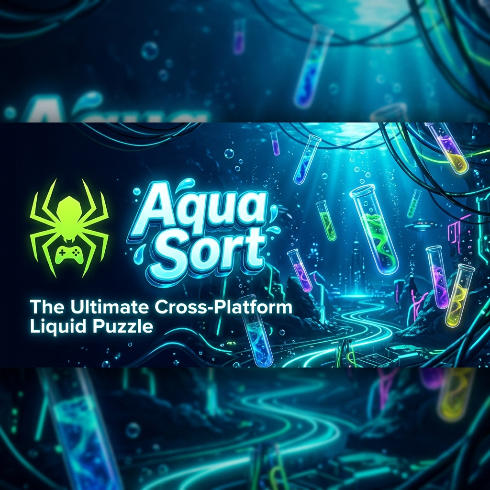
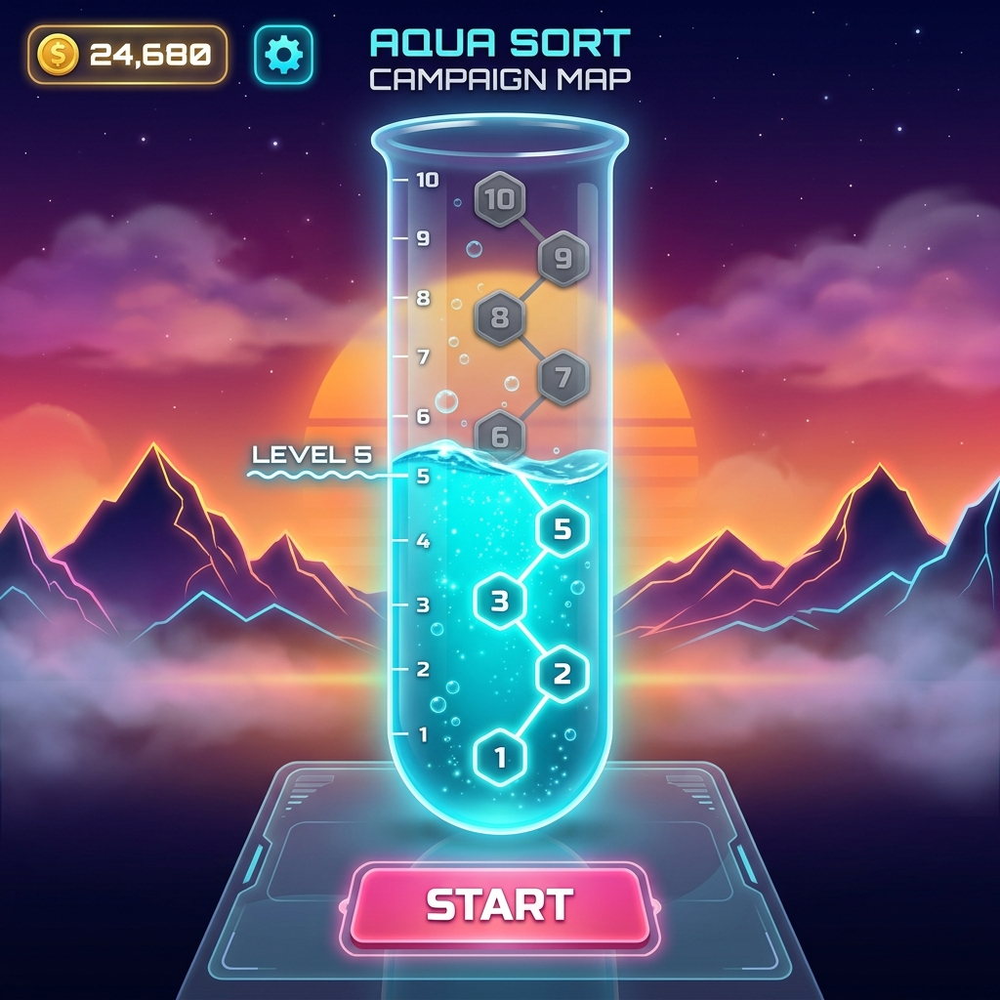
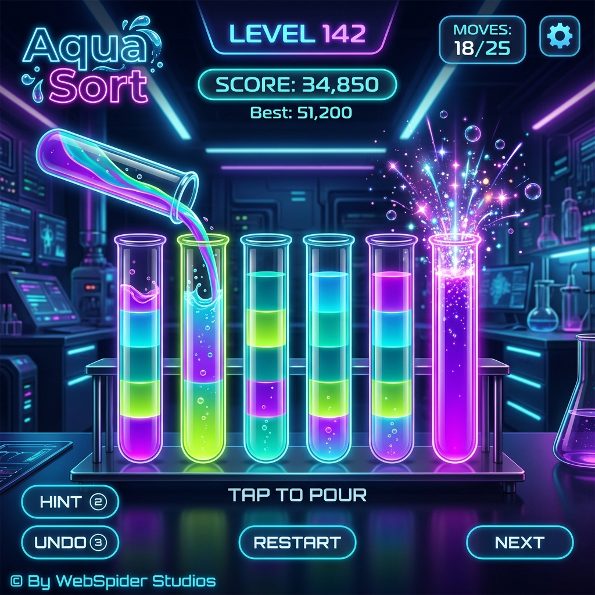

# Aqua Sort — Flutter (Cross-Platform)



## 📸 Showcase

| Campaign Map | Gameplay |
|:---:|:---:|
|  |  |

---

> 🚧 **This is the Flutter rebuild of the original Vanilla JS game.**  
> The original HTML/CSS/JS version lives at [`../aqua-sort-vanilla/`](../aqua-sort-vanilla/)

---

## 🎯 Target Platforms

| Platform | Store | Status |
|----------|-------|--------|
| Android | Google Play Store | 🔄 In development |
| iOS | Apple App Store | 🔄 In development |
| Windows | Steam | 🔄 In development |
| Linux | Steam | 🔄 In development |
| macOS | Steam / Mac App Store | 🔄 In development |
| Web | GitHub Pages | 🔄 In development |

---

## 🗂 Project Structure (Planned)

```
lib/
├── main.dart                  # App entry point
├── app.dart                   # MaterialApp / theme / routing
│
├── core/
│   ├── theme/                 # Colors, text styles, gradients
│   ├── router/                # go_router navigation
│   └── storage/               # SharedPreferences / Hive
│
├── features/
│   ├── auth/                  # Login, signup, OTP, guest mode
│   │   ├── screens/
│   │   └── providers/
│   ├── lobby/                 # Player setup, difficulty picker
│   │   ├── screens/
│   │   └── providers/
│   ├── game/                  # Puzzle engine, tube widget
│   │   ├── engine/            # Color logic, move validation, RNG
│   │   ├── widgets/           # TubeWidget, BoardWidget
│   │   ├── screens/
│   │   └── providers/
│   ├── leaderboard/           # Score display & storage
│   │   ├── screens/
│   │   └── providers/
│   └── profile/               # User profile, privacy settings
│       ├── screens/
│       └── providers/
│
└── shared/
    ├── widgets/               # GlassCard, GradientButton, OTPInput
    └── utils/                 # Validators, formatters, RNG
```

---

## 🛠 Tech Stack

| Layer | Package |
|-------|---------|
| State management | `flutter_riverpod` |
| Navigation | `go_router` |
| Local storage | `shared_preferences` + `hive_flutter` |
| Animations | `flutter_animate` |
| Firebase (future) | `firebase_auth`, `cloud_firestore` |
| In-app purchases | `in_app_purchase` |
| Steam (future) | `steamworks` / native plugin |

---

## 🚀 Getting Started

```bash
# Prerequisites: Flutter 3.x installed
flutter pub get
flutter run                    # Runs on connected device / emulator
flutter run -d windows         # Windows desktop
flutter run -d chrome          # Web
flutter build apk --release    # Android APK
flutter build ios --release    # iOS (requires macOS + Xcode)
```

---

## 🧠 Game Logic Port (from Vanilla JS)

The core puzzle logic from `game.js` will be ported to `lib/features/game/engine/`:

- `puzzle_generator.dart` — seeded RNG, tube filling algorithm
- `move_validator.dart` — can-pour checks, win detection
- `game_state.dart` — Riverpod state notifier for game board
- `tube_model.dart` — Tube data class (list of colors, max capacity)

---

## 📝 Roadmap

- [ ] Core game engine (tubes, colors, pour logic)
- [ ] Game board UI (TubeWidget with animations)
- [ ] Welcome/home screen (matching Aqua Sort brand)
- [ ] Auth flow (login, signup, OTP, guest)
- [ ] Lobby screen (player setup, difficulty)
- [ ] Leaderboard screen
- [ ] Profile & privacy settings
- [ ] Google Play Store release
- [ ] Apple App Store release
- [ ] Steam release (Windows build)
- [ ] Firebase backend (cloud scores, friends)
- [ ] Sound & haptic feedback
- [ ] Daily challenges

---

## ✨ Key Features

- 💧 **Advanced Liquid Shading**: 3D-styled glass tubes with layered gradients and specular highlights for a premium aesthetic.
- 🗺️ **Vertical Progress Map**: Level selection via a large, interactive test tube where water rises as you conquer levels.
- 👥 **Multiplayer Modes**: Support for Online and Offline Multiplayer. Offline mode triggers a forced **Landscape Mode** for optimized side-by-side gameplay.
- 🎉 **Sensory Celebration**: Fireworks particle systems and celebratory audio sync perfectly with victory.
- 🕷️ **Studio Integrated Auth**: Secure User ID login, Registration, and Guest Mode with WebSpider Studios branding throughout.
- ⚙️ **Optimized Engine**: Lightweight, fully offline support with local asset management.

---

## 🚀 Status

| Goal | Status |
|------|--------|
| Core Game Engine | ✅ Complete |
| Vertical Progress Map | ✅ Complete |
| Multiplayer (Offline/Landscape) | ✅ Complete |
| Sensory & Visual Polish | ✅ Complete |
| Studio Branding | ✅ Complete |
| Google Play Preparation | ✅ Complete |
| App Store Preparation | 🔄 In Progress |

---

## 📝 Roadmap

- [x] Core game engine (tubes, colors, pour logic)
- [x] Game board UI (TubeWidget with animations)
- [x] Welcome/home screen (Studio Branded)
- [x] Auth flow (login, signup, OTP, guest)
- [x] Progress Map screen
- [x] Leaderboard integration
- [ ] Daily challenges
- [ ] Apple App Store release
- [ ] Steam release (Windows build)

---

*Made with 💧 by WebSpider Studios*
